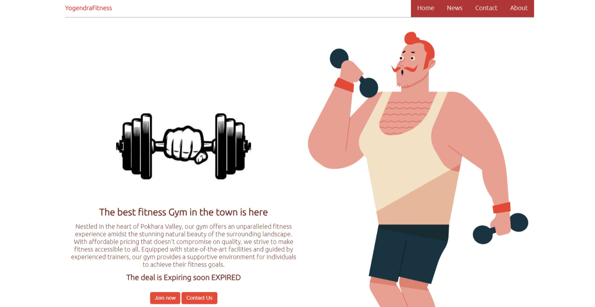

# Task 1 : Landing Page

this repository contain the first task of my internship at Prodigy Infotech company. 
## About Code:
For this task, i created the landing page called 'Yogendra Fitness Club' 

## How to Run:
To run this, 
- Install code editors.(for eg: VSCode) from here: [VSCode](https://code.visualstudio.com/download)
- Clone above repository in any folder 
- open that folder in VSCode 
- run 'index.html' file in any browser
And you can see the output of above code.

## Output:

## Feedback

If you have any feedback, please reach out to me at yogendrabaskota18@gmail.com 

